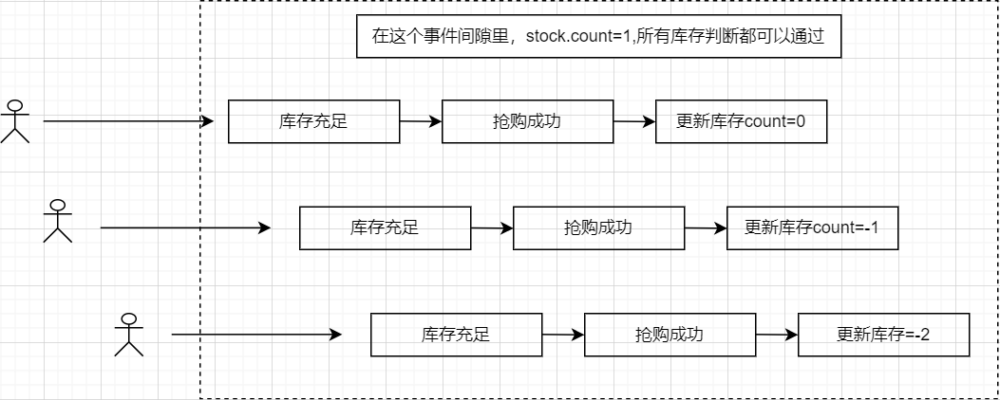
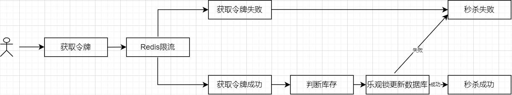
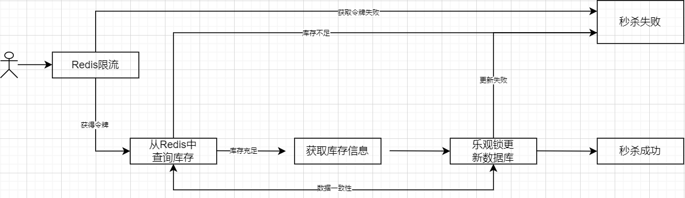

### 秒杀系统介绍

 秒杀无论是双十一购物还是 12306 抢票，秒杀场景已随处可见。简单来说，秒杀就是在同一时刻大量请求争抢购买同一商品并完成交易的过程。从架构视角来看，秒杀系统本质是一个高性能、高一致、高可用的系统。

#### 1 秒杀系统特点

秒杀活动对稀缺或者特价的商品进行定时定量售卖，吸引成大量的消费者进行抢购，但又只有少部分消费者可以下单成功。因此，秒杀活动将在较短时间内产生比平时大数十倍，上百倍的页面访问流量和下单请求流量。

1. 高并发：秒杀的特点就是这样时间极短、 瞬间用户量大。
2. 库存量少：一般秒杀活动商品量很少，这就导致了只有极少量用户能成功购买到。
3. 业务简单：流程比较简单，一般都是下订单、扣库存、支付订单
4. 恶意请求，数据库压力大
5. 秒杀的商品不需要添加到购物车
6. 秒杀系统独立部署


秒杀活动可以分为3个阶段：

1. 秒杀前：用户不断刷新商品详情页，页面请求达到瞬时峰值。
2. 秒杀开始：用户点击秒杀按钮，下单请求达到瞬时峰值。
3. 秒杀后：一部分成功下单的用户不断刷新订单或者产生退单操作，大部分用户继续刷新商品详情页等待退单机会。

#### 2 秒杀需要解决的问题

1. 商品超卖问题
2. 高平发的处理
3. 库存和订单一致性的问题

#### 3 秒杀系统设计理念

1. 限流：鉴于只有少部分用户能够秒杀成功，所以要限制大部分流量，只允许少部分流量进入服务后端（暂未处理）。
2. 削峰：对于秒杀系统瞬时的大量用户涌入，所以在抢购开始会有很高的瞬时峰值。实现削峰的常用方法有利用缓存或消息中间件等技术。
3. 异步处理：对于高并发系统，采用异步处理模式可以极大地提高系统并发量，异步处理就是削峰的一种实现方式。
4. 内存缓存：秒杀系统最大的瓶颈最终都可能会是数据库的读写，主要体现在的磁盘的 I/O，性能会很低，如果能把大部分的业务逻辑都搬到缓存来处理，效率会有极大的提升。
5. 可拓展：如果需要支持更多的用户或更大的并发，将系统设计为弹性可拓展的，如果流量来了，拓展机器就好。

#### 4 优化思路

- 后端优化：将请求尽量拦截在系统上游
  - 限流：屏蔽掉无用的流量，允许少部分流量走后端。假设现在库存为 `10`，有 `1000 `个购买请求，最终只有 `10 `个可以成功，`99%` 的请求都是无效请求
  - 削峰：秒杀请求在时间上高度集中于某一个时间点，瞬时流量容易压垮系统，因此需要对流量进行削峰处理，缓冲瞬时流量，尽量让服务器对资源进行平缓处理
  - 异步：将同步请求转换为异步请求，来提高并发量，本质也是削峰处理
  - 利用缓存：创建订单时，每次都需要先查询判断库存，只有少部分成功的请求才会创建订单，因此可以将商品信息放在缓存中，减少数据库查询
  - 负载均衡：利用 Nginx 等使用多个服务器并发处理请求，减少单个服务器压力
- 前端优化：
  - 限流：前端答题或验证码，来分散用户的请求
  - 禁止重复提交：限定每个用户发起一次秒杀后，需等待才可以发起另一次请求，从而减少用户的重复请求
  - 本地标记：用户成功秒杀到商品后，将提交按钮置灰，禁止用户再次提交请求
  - 动静分离：将前端静态数据直接缓存到离用户最近的地方，比如用户浏览器、CDN 或者服务端的缓存中
- 防作弊优化：
  - 隐藏秒杀接口：如果秒杀地址直接暴露，在秒杀开始前可能会被恶意用户来刷接口，因此需要在没到秒杀开始时间不能获取秒杀接口，只有秒杀开始了，才返回秒杀地址 url 和验证 MD5，用户拿到这两个数据才可以进行秒杀
  - 同一个账号多次发出请求：在前端优化的禁止重复提交可以进行优化；也可以使用 Redis 标志位，每个用户的所有请求都尝试在 Redis 中插入一个 `userId_secondsKill` 标志位，成功插入的才可以执行后续的秒杀逻辑，其他被过滤掉，执行完秒杀逻辑后，删除标志位
  - 多个账号一次性发出多个请求：一般这种请求都来自同一个 IP 地址，可以检测 IP 的请求频率，如果过于频繁则弹出一个验证码
  - 多个账号不同 IP 发起不同请求：这种一般都是僵尸账号，检测账号的活跃度或者等级等信息，来进行限制。比如微博抽奖，用 iphone 的年轻女性用户中奖几率更大。通过用户画像限制僵尸号无法参与秒杀或秒杀不能成功


### 系统实现

#### 1 基本思路




```java
public int createNormalOrder(int sid) {

    //检查库存
    Stock stock = stockService.checkStock(sid);
    //出售
    stockService.saleStock(stock);
    //创建订单
    return createOrder(stock);
}
//检查库存
public Stock checkStock(int sid) {

    Stock stock = stockMapper.selectStockById(sid);

    if (stock.getCount() < 1) {
        throw new RuntimeException("库存不足");
    }
    return stock;
}
//出售
public int saleStock(Stock stock) {

    stock.setCount(stock.getCount() - 1);
    stock.setSale(stock.getSale() + 1);
    
    return stockMapper.updateStockById(stock);
}
//创建订单
private int createOrder(Stock stock) {

    Order order = new Order();
    order.setSid(stock.getId());
    order.setCreateTime(new Date());
    int result = orderMapper.insertOrder(order);
    if (result == 0) {
        throw new RuntimeException("创建订单失败");
    }
    return result;
}
```

可能会出现超卖问题

#### 2 乐观锁解决超卖问题


```java
//乐观锁
public int createOptimisticLock(int sid) {

    Stock stock = stockService.checkStock(sid);
    int count = stockService.updateStockByOptimisticLock(stock);
    if (count == 0) {
        throw new RuntimeException("并发更新库存失败");
    }
    return createOrder(stock);
}
```

```sql
@Update("UPDATE sk_stock SET count = count - 1, sale = sale + 1, version = version + 1 " +
        "WHERE id = #{id, jdbcType = INTEGER} " +
        "AND version = #{version, jdbcType = INTEGER}")
int updateByOptimistic(Stock stock);
```

#### 3 redis计数限流



根据前面的优化分析，假设现在有`10`个商品，有`1000`个并发秒杀请求，最终只有`10`个订单会成功创建，也就是说有`990`的请求是无效的，这些无效的请求也会给数据库带来压力，因此可以在在请求落到数据库之前就将无效的请求过滤掉，将并发控制在一个可控的范围，这样落到数据库的压力就小很多。

在 `RedisPool `中对 `Jedis `线程池进行了简单的封装，封装了初始化和关闭方法，同时在 `RedisPoolUtil `中对 `Jedis `常用 `API `进行简单封装，每个方法调用完毕则关闭 `Jedis `连接。限流要保证写入 `Redis `操作的原子性，因此利用 `Redis `的单线程机制，通过 `lua`脚本来完成。

```java
/**
 * Redis 限流
 */
public class RedisLimit {
    private static final int FAIL_CODE = 0;
    @Value("${spring.redis.limit}")
    private Integer limit;
    
    public Boolean limit() {
        Jedis jedis = null;
        long result = 0;
        try {
            // 获取 jedis 实例
            jedis = RedisPool.getJedis();
            // 解析 Lua 文件
            String script = ScriptUtil.getScript("limit.lua");
            // 请求限流
            String key = String.valueOf(System.currentTimeMillis() / 1000);
            // 计数限流
            result = (long) jedis.eval(script, Collections.singletonList(key),
                    Collections.singletonList(String.valueOf(limit)));
            if (FAIL_CODE != result) {
                log.info("成功获取令牌");
                return true;
            }
        } catch (Exception e) {
            log.error("limit 获取 Jedis 实例失败：", e);
        } finally {
            RedisPool.jedisPoolClose(jedis);
        }
        return false;
    }
}

/**
 * 乐观锁加redis限流
 *
 */
@PostMapping("createOptimisticLockWithLimitOrder")
public String createOptimisticLockWithLimitOrder(int sid) {
    int res = 0;
    try {
        if (redisLimit.limit()) {
            res = orderService.createOptimisticLock(sid);
        }
    } catch (Exception e) {
        log.error("Exception: " + e);
    }
    return res == 1 ? SUCCESS : ERROR;
}
```

```lua
-- 计数限流
-- 每次请求都将当前时间，精确到秒作为 key 放入 Redis 中，超时时间设置为 2s， Redis 将该 key 的值进行自增
-- 当达到阈值时返回错误，表示请求被限流
-- 写入 Redis 的操作用 Lua 脚本来完成，利用 Redis 的单线程机制可以保证每个 Redis 请求的原子性

-- 资源唯一标志位
local key = KEYS[1]
-- 限流大小
local limit = tonumber(ARGV[1])

-- 获取当前流量大小
local currentLimit = tonumber(redis.call('get', key) or "0")

if currentLimit + 1 > limit then
    -- 达到限流大小 返回
    return 0
else
    -- 没有达到阈值 value + 1
    redis.call("INCRBY", key, 1)
    -- 设置过期时间
    redis.call("EXPIRE", key, 2)
    return currentLimit + 1
end
```


#### 4 redis缓存库存信息



虽然限流能够过滤掉一些无效的请求，但是还是会有很多请求落在数据库上，通过 `Druid` 监控可以看出，实时查询库存的语句被大量调用，对于每个没有被过滤掉的请求，都会去数据库查询库存来判断库存是否充足，对于这个查询可以放在缓存 `Redis `中，`Redis `的数据是存放在内存中的，速度快很多。

##### 4.1 数据预热

在秒杀开始前，需要将秒杀商品信息提前缓存到 `Redis `中，这么秒杀开始时则直接从 `Redis `中读取，也就是缓存预热，`Springboot `中开发者通过 `implement ApplicationRunner` 来设定 `SpringBoot `启动后立即执行的方法

```java
public void run(ApplicationArguments args) throws Exception {
    // 从数据库中查询热卖商品存入redis
    Stock stock = stockService.getStockById(1);

    // 删除旧缓存
    RedisPoolUtil.del(RedisKeysConstant.STOCK_COUNT + stock.getCount());
    RedisPoolUtil.del(RedisKeysConstant.STOCK_SALE + stock.getSale());
    RedisPoolUtil.del(RedisKeysConstant.STOCK_VERSION + stock.getVersion());

    //缓存预热
    int sid = stock.getId();
    RedisPoolUtil.set(RedisKeysConstant.STOCK_COUNT + sid, String.valueOf(stock.getCount()));
    RedisPoolUtil.set(RedisKeysConstant.STOCK_SALE + sid, String.valueOf(stock.getSale()));
    RedisPoolUtil.set(RedisKeysConstant.STOCK_VERSION + sid,
            String.valueOf(stock.getVersion()));
}
```

##### 4.2 缓存和数据一致性


